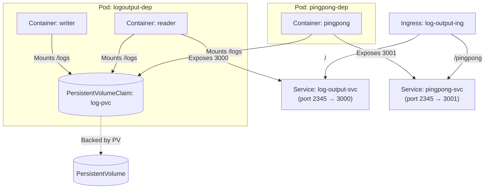

This project demonstrates a Kubernetes Pod running **two containers** (sidecar) that communicate via a shared volume (emptyDir):

- **Writer Container:** Generates a random string at startup and appends a line with the string and a timestamp to a log file every 5 seconds.
- **Reader Container:** Exposes an HTTP endpoint (`/`) that returns the current contents of the log file.
- **pingpong Container:** Exposes an HTTP endpoint (`/pingpong`) that returns the pong <counter>.

## Architecture

 @ https://mermaid.live

## Usage

### 1. Build and Push Images ( optional )

Build and push both containers
Writer

`docker build -t dockerhub-user/writer:latest ./writer`

`docker push dockerhub-user/writer:latest`

Reader

`docker build -t dockerhub-user/reader:latest ./reader`

`docker push dockerhub-user/reader:latest`

pinpong

`docker build -t dockerhub-user/reader:latest ./pingpong`

`docker push dockerhub-user/pingpong:latest`

### 2. Deploy to Kubernetes

Apply the manifests:

`kubectl apply -f pv-pvc/*`

`kubectl apply -f manifests/*`

### 3. Access the Logs

If exposed via a service or ingress, access the logs at:
cumulative output : [`http://localhost:8081`](http://localhost:8081)

pingpong endpoint: [`http://localhost:8081/pingpong`](http://localhost:8081/pingpong)

