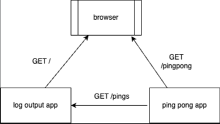
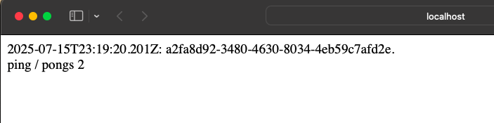

This project demonstrates a Kubernetes Pods running and communicate via network and dns names.

- **log-output-app pod:** Log output application generates logs every 5 second with a random string, 

    ex: 2020-03-30T12:15:17.705Z: 8523ecb1-c716-4cb6-a044-b9e83bb98e43.

-  Exposes an HTTP endpoint (`/`) that returns the Log output and ping-pong count (recieved by GET /pings).

- **ping-pong-app pod:** Exposes via HTTP endpoint (`/pingpong`) that returns the pong <counter>.

## Architecture

## Usage

### 1. Deploy to Kubernetes

Apply the manifests:

`kubectl apply -f manifests/`

### 2. Access the Logs

If exposed via a service or ingress, access the logs at:
cumulative output : [`http://localhost:8081`](http://localhost:8081)

pingpong endpoint: [`http://localhost:8081/pingpong`](http://localhost:8081/pingpong)

### 3. Verify

Check that the applications are running in the new namespace:

kubectl get pods --namespace=exercises