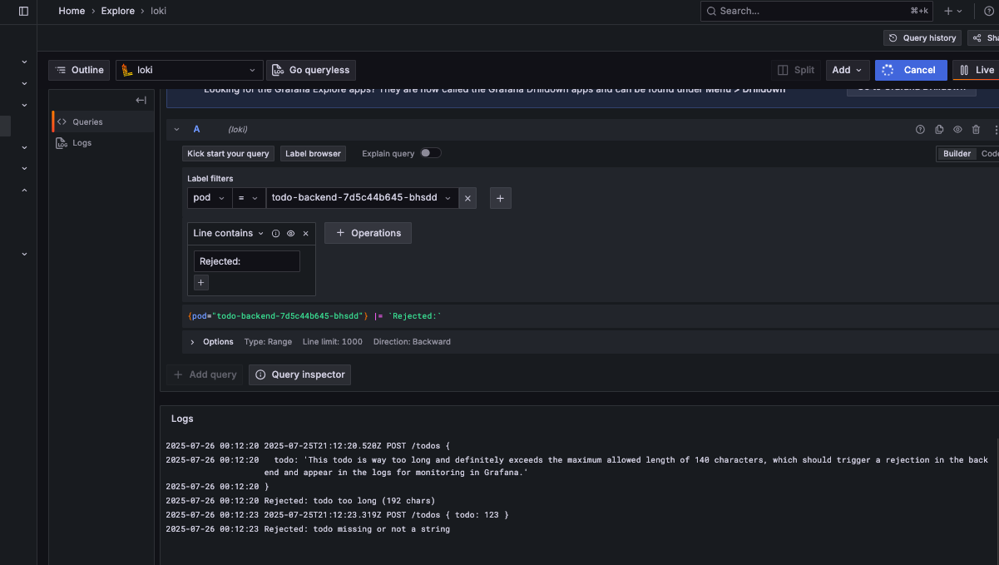

# Project Deployment

This project server at HTTP endpoint :

- **Endpoint:** `http://localhost:8081/`

## How to Deploy

Apply the Kubernetes manifests using:

`kubectl apply -f ./manifests`

## Monitoring 
